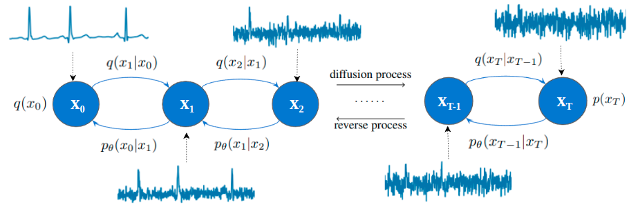

# ECG-Diffusion-DiffWave

This is the official implementation of paper ["A Novel Approach for Long ECG Synthesis Utilize Diffusion Probabilistic Model"](https://dl.acm.org/doi/abs/10.1145/3591569.3591621)



[//]: # (![DIFFWAVE MODEL]&#40;images/diffwave.png&#41;)

## Prerequisite

```pip install -r requirements.txt```
- Prepare the **wfdb** library

## Training

1. Prepare Dataset
   - Download the Physionet MIT-DB dataset ([link](https://www.physionet.org/content/mitdb/1.0.0/))
   - Rename the downloaded dataset to **mitdb** and place it in folder **data**
2. Modify some values in file **config.py**:
   - TIME_DURATION: take values of 10 or 20s, define length of signal for model to train/generate.
   - Field 'T' in MODEL_CONFIG: define number of time steps.
   - Note: do not change fields 'beta_1' and 'beta_2' if not necessary.
3. Run file **main.py** or command ```python main.py``` to train model.
   - Folder **logs** with other sub-folders are created.
   - Checkpoints are saved in folder **logs/training/checkpoints**. 
   - Generated results of training are saved in folder **logs/training/results**. 

## Inference

1. Modify value in file **config.py**:
   - TEST_CKPT_PATH: path to checkpoint used to test
   - Generated results are saved in folder **test_results**, created when inferencing..
2. Run file **test.py** with specific arguments
   - test_samples: Number of samples to generate
   - time_duration: Length of generated sample in seconds
   ```commandline
   python test.py --test_samples 10 --time_duration 10
   ```
3. Demo 
   - We release a [checkpoint](https://drive.google.com/file/d/15ifcd9CevvFSYxAUUc06xa5hchW1vUqa/view?usp=sharing) to generate sinus rhythm
   - Set TEST_CKPT_PATH in file **config.py** by the path to downloaded checkpoint.
   - Run file **test.py** as step 2
   - Demo results:
   

## Citation 
If you find this work useful for your research, please consider citing:

```
@inproceedings{tran2023novel,
  title={A Novel Approach for Long ECG Synthesis Utilize Diffusion Probabilistic Model},
  author={Tran, Diem Thi and Tran, Quoc Ngoc and Dang, Thi Thu Khiet and Tran, Dat Hoang},
  booktitle={Proceedings of the 2023 8th International Conference on Intelligent Information Technology},
  pages={251--258},
  year={2023}
}
```